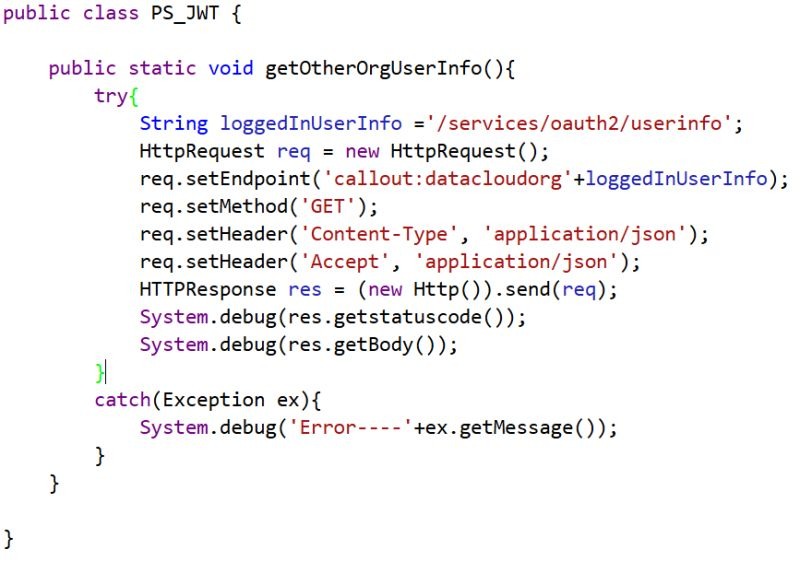

Implemented a secure Salesforce org-to-org integration leveraging the JWT Bearer Authentication Flow to enable seamless, password-less communication between a source org and a target org.

🔐 Implementation Highlights:

1) Generated a digital certificate using OpenSSL and validated manual certificate creation.
2) Configured a Connected App in the target org with JWT-based OAuth authentication.
3) Uploaded the JKS file in Certificate and Key Management
4) Create Self signed certificate in source org and create identity provider then choose self signed certificate.
5) Configured External Credentials and Named Credentials in the source org
Established secure, automated API communication between both orgs without user intervention.

⚙️ Why JWT Bearer Flow?
1) Eliminates the need for username and password sharing
2) Designed for server-to-server and org-to-org integrations
3) Provides a highly secure, scalable authentication mechanism
This implementation delivers a robust, secure, and automated integration aligned with enterprise-grade Salesforce security standards.

How JWT (JSON Web Token) Works :

1️⃣ JWT Creation
 The client (source system) creates a JWT consisting of:
Header (algorithm & token type)
Payload (claims like issuer, subject, audience, expiry)

2️⃣ Token Signing
The Header and Payload are Base64URL encoded
They are digitally signed using a private key
This creates the JWT Signature

3️⃣ JWT Sent to Authorization Server
The signed JWT is sent to the authorization server (e.g., Salesforce OAuth endpoint)
Sent as part of an authentication request

4️⃣ JWT Validation
 The authorization server:
Verifies the signature using the public key
Validates claims (iss, sub, aud, exp)
Checks token expiration

5️⃣ Access Token Issued
If the JWT is valid, the server issues an OAuth access token
This access token represents an authenticated session

💡 Continuously exploring secure authentication strategies and real-world integration patterns within the Salesforce ecosystem.
